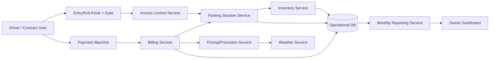
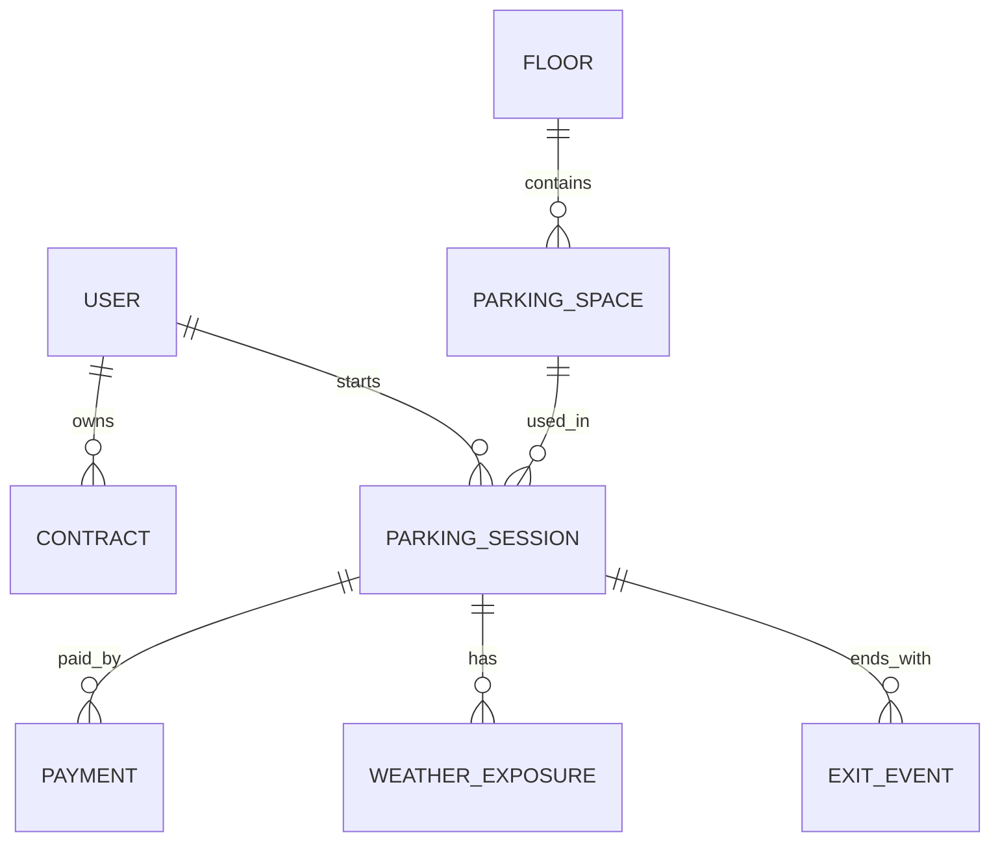

# ParkingManager

## Request analysis (key points)

### Core system parts
- **Access control**: entry/exit gates, ticket/contract identification, user identity assurance.
- **Parking inventory**: total free spaces (high priority) and free spaces per floor (preferred), split by covered/uncovered.
- **Billing engine (most critical)**: time-based charging, payment-machine flow, contract billing, 10-minute exit grace period.
- **Weather/rainy promotion**: for uncovered spaces, discount is evaluated at payment time and applied when at least 33% of recorded parking time was rainy.
- **Reporting/analytics**: monthly business insights (revenue, occupancy, promotion impact, profitability).

### Key processes
1. **Vehicle entry**: identify user (ticket/card/contract), assign eligible space, start parking session.
2. **Parking session tracking**: occupancy and weather exposure timelines are recorded.
3. **Payment before exit**: user pays at floor payment machine or according to pre-signed contract rules.
4. **Exit validation**: gate allows exit only if paid and within 10 minutes; otherwise additional charge is required.
5. **Monthly reporting**: aggregate revenue, occupancy, rainy promotion usage/profitability.

### Potential problem areas
- Payment correctness (highest risk if wrong).
- Race conditions between payment timestamp and gate exit timestamp (for example, simultaneous events may wrongly pass or fail grace-period checks).
- Weather attribution accuracy for the defined rule: at least 33% of parking time during rain (data source reliability and weather transition timing directly affect billing).
- Incorrect inventory counts under concurrent entry/exit.
- Fraud/identity misuse without strong authentication.

## Conceptual architecture

### Big-picture component diagram


### Big-picture data model


## Key process pseudocode (billing + exit)

```text
function payForSession(sessionId, paymentChannel, now):
    session = loadSession(sessionId)
    assert session.status == "ACTIVE"
    RAINY_DISCOUNT_THRESHOLD = 0.33

    parkedMinutes = minutesBetween(session.entryTime, now)
    baseAmount = priceEngine.calculateBase(session.spaceType, parkedMinutes)

    rainyMinutes = weatherExposureMinutes(sessionId, rain=true)
    rainyRatio = 0
    if parkedMinutes > 0:
        rainyRatio = rainyMinutes / parkedMinutes

    if session.spaceType == "UNCOVERED" and parkedMinutes > 0 and rainyRatio >= RAINY_DISCOUNT_THRESHOLD:
        amount = baseAmount * 0.5
    else:
        amount = baseAmount

    recordPayment(sessionId, amount, paymentChannel, paidAt=now)
    session.paidUntil = addMinutes(now, 10)
    session.status = "PAID_WAITING_EXIT"
    save(session)

function validateExit(sessionId, now):
    session = loadSession(sessionId)
    assert session.status in {"ACTIVE", "PAID_WAITING_EXIT"}

    if session.status == "PAID_WAITING_EXIT" and now <= session.paidUntil:
        closeSession(sessionId, exitTime=now)
        freeSpace(session.spaceId)
        openGate()
        return

    additionalAmount = recalculateWithExtraTime(session, now)
    denyExit("Additional payment required: " + additionalAmount)
```

Rainy-threshold note: rainy ratio is guarded by `parkedMinutes > 0`, and the discount condition also checks `parkedMinutes > 0`; for `parkedMinutes <= 0` the rainy ratio remains `0` and no rainy discount is applied.

## Priority and scope notes
- **Never compromise**: charging logic and payment auditability.
- **Very important**: accurate total free-space count.
- **Secondary but included**: per-floor free-space count and rainy promotion analytics.
- **Constraint**: uncovered spaces must remain <= 15% of total garage capacity.

## Generated .NET application

The repository now includes a runnable ASP.NET Core Web API implementation under `src/ParkingManager.Api`.

### What is implemented
- Vehicle entry with space assignment (`covered` preferred or fallback to any free space).
- Real-time inventory totals and per-floor free-space counts (covered/uncovered split).
- Billing with hourly pricing, payment recording, and 10-minute grace period for exit.
- Rainy promotion for uncovered spaces: 50% discount when rainy exposure is at least 33% of the parking time at payment moment.
- Exit validation with additional-charge calculation after grace period expiration.
- Monthly report endpoint with revenue, occupancy ratio, and promotion impact.
- Constraint enforcement: uncovered spaces are capped at 15% of lot capacity.

### Run

From repository root:

```bash
dotnet run --project src/ParkingManager.Api/ParkingManager.Api.csproj
```

Swagger UI will be available at:

```text
http://localhost:5000/swagger
```

### Main endpoints
- `GET /api/inventory`
- `POST /api/sessions/entry`
- `GET /api/sessions/{sessionId}`
- `POST /api/sessions/{sessionId}/payment`
- `POST /api/sessions/{sessionId}/exit`
- `POST /api/weather/interval`
- `GET /api/reports/monthly?year=2026&month=6`

### Sample flow

1. Register a rainy interval.
2. Create an entry session.
3. Pay for the session.
4. Validate exit.
5. Review monthly report.