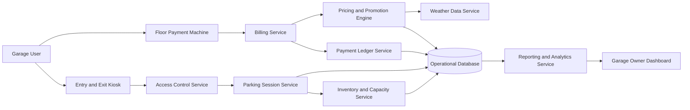
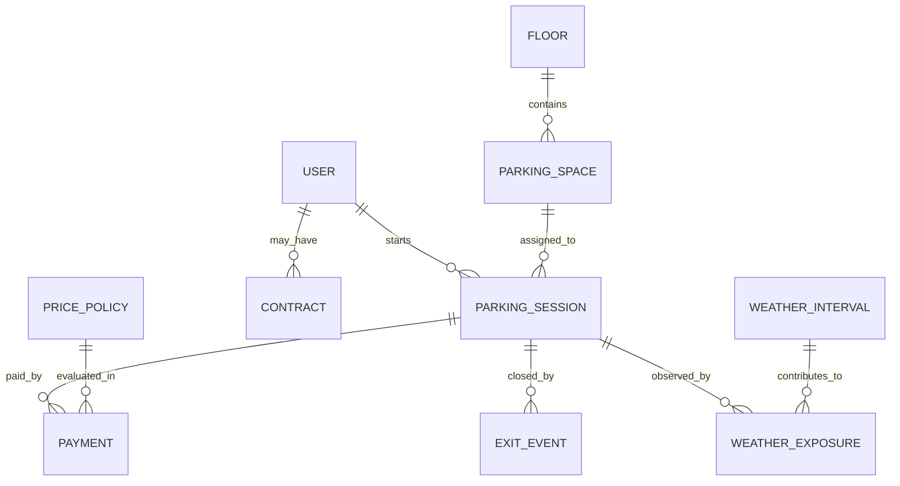
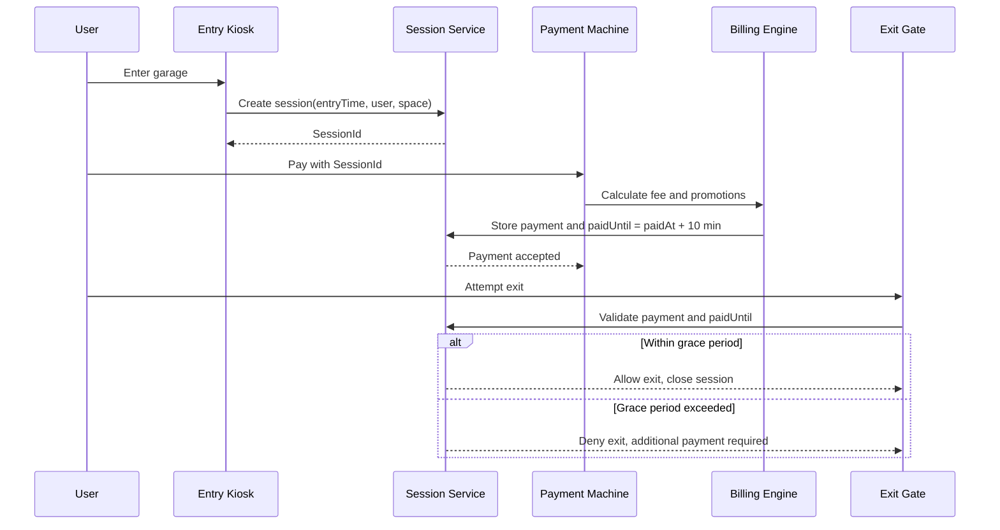

# USER_REQ-SPECS

## 1. Request Analysis

### 1.1 Key System Parts

1. Parking Session and Access Control
- Track entry time, parking duration, and exit validation.
- Support user identification and identity assurance.
- Handle multiple user types (casual, contract, others).

2. Billing and Payment Engine (highest priority)
- Charge by occupied time.
- Support payment at floor payment machines.
- Support pre-signed contract billing flows.
- Enforce the rule that payment is not allowed at the exit gate.
- Enforce 10-minute exit grace period after payment.

3. Capacity and Space Management
- Maintain total free space count (very important).
- Provide free space count per floor (preferred).
- Respect constraint: uncovered spaces <= 15% of total capacity.

4. Weather Promotion Logic
- Rainy action applies to uncovered spaces.
- Uncovered-space pricing should be 50% of covered pricing when rainy condition is met.
- Rainy condition threshold: at least 33% of parked time during rain.

5. Reporting and Business Analytics
- Monthly reporting required.
- Include occupancy, revenue, profitability, and rainy-action impact.
- Leave extension points for future promotions and analytics.

### 1.2 Key Processes

1. Vehicle Entry
- Identify user and user type.
- Start parking session with timestamp and assigned space.
- Update real-time capacity counters.

2. Active Session Tracking
- Record time in garage and assigned space type.
- Record weather exposure over time for rainy-action eligibility.

3. Payment Processing
- Compute parking fee based on occupied time and pricing policy.
- Apply rainy discount for uncovered spaces if rainy ratio >= 33%.
- Register payment and start 10-minute exit window.

4. Exit Validation
- Verify payment status and grace window at gate.
- Allow exit if still within grace period.
- Require additional payment for overstayed exits.

5. Monthly Reporting
- Aggregate sessions, payments, occupancy, discounts, and profitability metrics.
- Provide management insight for business analysis.

### 1.3 Potential Problems and Risks

1. Billing correctness risk
- Incorrect fee calculation directly impacts trust and revenue.

2. Time-bound race conditions
- Edge cases around payment timestamp vs. exit timestamp.

3. Rainy-discount attribution risk
- Inaccurate weather timeline or threshold evaluation may misprice sessions.

4. Concurrency and consistency
- Simultaneous entry and exit can break free-space counters if not transactional.

5. Identity and fraud risk
- Weak identification allows account misuse or unauthorized exits.

6. Policy extensibility risk
- Future promotions may conflict with existing billing logic if not modular.

## 2. Conceptual Solution Architecture

### 2.1 Architecture Goals

- Billing accuracy above all other concerns.
- Clear separation between operational workflows and analytics.
- Deterministic and auditable pricing decisions.
- Real-time capacity visibility.
- Extensible policy engine for promotions.

### 2.2 Logical Component View



### 2.3 Big Picture Data Model



### 2.4 Runtime Sequence (Billing and Exit)



## 3. Key Pseudocode

### 3.1 Payment Calculation with Rainy Action

```text
function registerPayment(sessionId, paidAt, paymentChannel):
    session = loadSession(sessionId)
    assert session.status == ACTIVE

    occupiedMinutes = minutesBetween(session.entryTime, paidAt)
    baseAmount = calculateBaseTariff(session.spaceType, occupiedMinutes, session.userType)

    rainyMinutes = calculateRainyExposureMinutes(sessionId, session.entryTime, paidAt)
    rainyRatio = 0
    if occupiedMinutes > 0:
        rainyRatio = rainyMinutes / occupiedMinutes

    discount = 0
    if session.spaceType == UNCOVERED and rainyRatio >= 0.33:
        discount = baseAmount * 0.50

    chargedAmount = max(0, baseAmount - discount)

    payment = createPayment(
        sessionId = sessionId,
        baseAmount = baseAmount,
        discount = discount,
        chargedAmount = chargedAmount,
        paidAt = paidAt,
        channel = paymentChannel
    )

    session.status = PAID_WAITING_EXIT
    session.paidUntil = paidAt + 10 minutes
    save(session)
    save(payment)

    return payment
```

### 3.2 Exit Validation

```text
function validateExit(sessionId, now):
    session = loadSession(sessionId)

    if session.status != PAID_WAITING_EXIT:
        return deny("Payment required before exit")

    if now <= session.paidUntil:
        session.status = CLOSED
        session.exitTime = now
        freeSpace(session.spaceId)
        save(session)
        return allow()

    additionalAmount = calculateAdditionalCharge(session, now)
    return denyWithAmount(additionalAmount)
```

### 3.3 Capacity Update

```text
function assignSpace(preferCovered):
    candidate = findFreeSpace(preferCovered)
    if candidate is null:
        throw "No free spaces"

    markOccupied(candidate.id)
    updateCounters(totalFree - 1, freeByFloor[candidate.floor] - 1)
    return candidate
```

## 4. Non-Functional Focus

1. Accuracy and auditability
- All fee calculations should be reproducible from stored session, weather, and policy data.

2. Consistency and integrity
- Capacity and session updates should be transactional.

3. Traceability
- Keep immutable payment records and rule version identifiers for audits.

4. Availability
- Payment and exit-validation services should be resilient because they are operationally critical.

## 5. Open Design Questions

1. User identity method at entry
- Card, ticket, license plate recognition, mobile app, or combined approach.

2. Contract billing specifics
- Settlement intervals, invoice structure, and grace-period treatment for contract users.

3. Future promotions
- Whether promotions can stack with rainy action and how priority rules should be defined.

4. Regulatory and privacy requirements
- Retention period for identity and session data.
